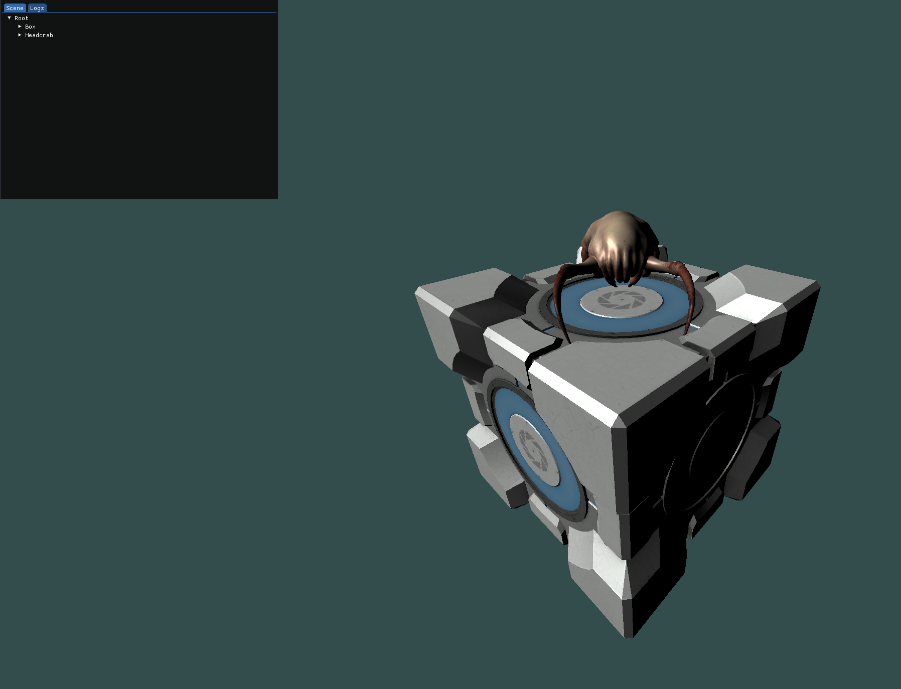

# OpenGL Scene Viewer

## Build

Simply load the solution from your IDE and build it.

> **NOTE:** Visual Studio can fail to compile because the solution may have not been retargeted.

## Bindings

Hold RMB + WASD to move the camera around.

Space / Left Shift to move upwards / downwards.
